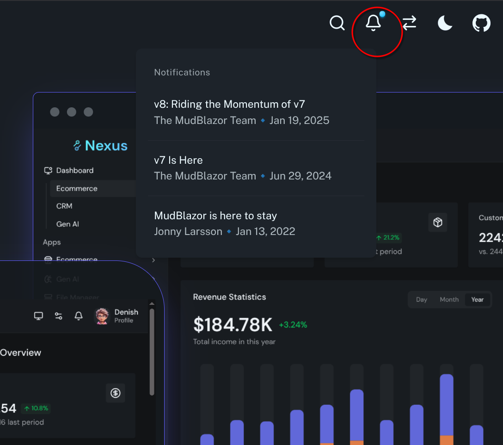

# Replicating and Optimizing the MudBlazor.com Landing Page

The landing page of <mudblazor.com is mostly static, yet it suffers from unusually long loading times — as confirmed by [Google PageSpeed Insights (June 13, 2025)](https://pagespeed.web.dev/analysis/https-www-mudblazor-com/u4kgm8bxog?form_factor=mobile). Given that the MudBlazor team consists of seasoned Blazor experts, I initially wondered whether this might point to a fundamental limitation of Blazor — especially when building fast, SEO-friendly landing pages.

When I tried to get answers from the community, [I received no clear responses and even some dislikes for my question](https://github.com/MudBlazor/MudBlazor/discussions/11495). This pushed me to figure it out myself. What I found: Blazor can absolutely develop very fast landing pages. The original page's slow load time was due to a poor choice in its rendering mode.

This repository demonstrates my optimized replication. Unlike the original, [it loads instantly!](https://pagespeed.web.dev/analysis/https-metallica-f-riders-precious-trycloudflare-com/h3c7ph3ptl?form_factor=desktop)

## Features

The replication keep all the dynamic content similar to the original, each data retrieval simulation took 10s (`Task.Delay(10_000)`), you can change it in [SimulationOptions.cs](./DaisyMudDomain/SimulationOptions.cs)

### Search dialog
 
 

### notification

### country list & stats

### testimonials

## Performance comparison

//TODO
