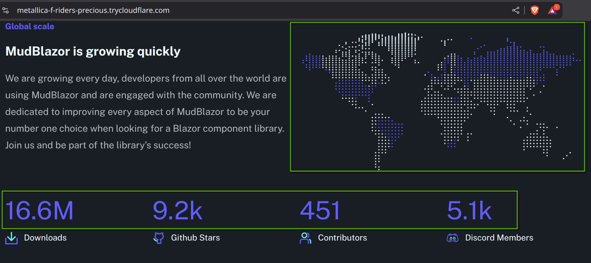
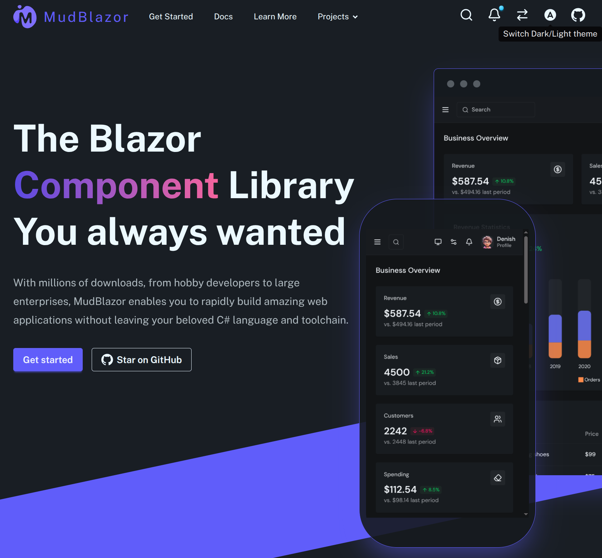

# Replicating and Optimizing the MudBlazor.com Landing Page

The landing page of <mudblazor.com> is mostly static, yet it suffers from unusually long loading times (cf. Performance section below). Given that the MudBlazor team consists of seasoned Blazor experts, I initially wondered whether this might point to a fundamental limitation of Blazor — especially when building fast, SEO-friendly landing pages.

When I tried to get answers from the community, [I received no clear responses and even some dislikes for my question](https://github.com/MudBlazor/MudBlazor/discussions/11495). This pushed me to figure it out myself. **What I found: Blazor can absolutely develop very fast landing pages**. The original page's slow load time was due to a poor choice in its rendering mode.

This repository demonstrates my optimized replication. Unlike the original, **it loads instantly!** (cf. Performance section below).

## Features

This replication simulates all dynamic content which might have on the original MudBlazor.com landing page.
Each data retrieval is intentionally [delayed by 10 seconds](./DaisyMudDomain/SimulationOptions.cs) (`Task.Delay(10_000)`). This exaggerated latency demonstrates that even with slow dynamic content, a landing page (which is mostly static) can still load instantly.

### Search dialog

[Fake data retreival simulation](./app/DaisyMudDomain/SearchService.cs)

 

### Notification

[Fake data retreival simulation](./app/DaisyMudDomain/NotificationService.cs)


### Country list & Stats

[Fake data retreival simulation](./app/DaisyMudDomain/CountryListService.cs)



### Testimonial

[Fake data retreival simulation](./app/DaisyMudDomain/TestimonialService.cs)


### Text direction switcher (RTL, LTR)


### Theme switcher (Dark, Light, Auto)



### Mock up Application

A complex dashboard demo (from [nexus.daisyui.com/dashboards/ecommerce](https://nexus.daisyui.com/dashboards/ecommerce)) is embedded via an iframe within a mobile/tablet mockup.

This approach, which I've used to save development time, offers superior isolation and maintainability compared to MudBlazor.com's original "direct embedding" method. Using an iframe keeps the demo application isolated, simplifying maintenance for both the main landing page and the demo itself.

While my replication only synchronizes the Dark/Light theme setting and cannot synchronize the Text Direction setting (due to cross-domain limitations); the original MudBlazor's demo app, being on the same domain, could fully benefit from my iframe technique without sacrificing any features.


### Drawer - Mobile first

I didn't spent much effort to replicate the app drawer, But here it is functional..


### Codes demo animation

I discovered a small animation here last minute and added it to this replication.. These are advance CSS for me (I only knew basic CSS stuff). Most CSS problem was solved with help of various LLMLs.


## Performance comparison

This comparison highlights the significant performance gains of the optimized replication, even under less-than-ideal conditions

The replication was run locally using `dotnet run` (without `--release`) and temporarily exposed via a [Cloudflare dev tunnel](https://developers.cloudflare.com/pages/how-to/preview-with-cloudflare-tunnel/) .

While these "Apple vs. Orange" comparisons are not strictly scientific, they provide a strong indication of the improved user-perceived performance.

### Google's pagespeed

|                                        | Mobile | Desktop | Link                                                                                                                   |
| -------------------------------------- | ------ | ------- | ---------------------------------------------------------------------------------------------------------------------- |
| Official <mudblazor.com>               | 34     | 40      | <https://pagespeed.web.dev/analysis/https-www-mudblazor-com/jqmjl4bu2u?form_factor=desktop>                              |
| Replication<br>(via Cloudflare Tunnel) | 59     | 86      | <https://pagespeed.web.dev/analysis/https-eur-starter-richard-becoming-trycloudflare-com/49hm85qqx4?form_factor=desktop> |

### GTMetrix metrix

|                                        | Performance | Largest Contentful Paint | Total Blocking Time | Time to interractive | Fully loaded |                                                                                         |
| -------------------------------------- | ----------- | ------------------------ | ------------------- | -------------------- | ------------ | --------------------------------------------------------------------------------------- |
| Official <mudblazor.com>               | 33%         | 13.3s                    | 3s                  | 14.3                 | 13.6         | <https://gtmetrix.com/reports/www.mudblazor.com/CN8eBGjK/>                                |
| Replication<br>(via Cloudflare Tunnel) | 88%         | 1.5s                     | 34ms                | 8s                   | 32.4s        | <https://gtmetrix.com/reports/broadway-wins-exceptions-satin.trycloudflare.com/CgnjGllY/> |

## How the Optimization Was Implemented

The original MudBlazor.com landing page likely uses **Interactive WebAssembly**, a poor choice for static-content-heavy landing pages.

My replication utilizes **Static Server rendering for most components**, switching to **Interactive Server rendering** only for components requiring dynamic server data.

### Server Data Display & Double Loading Mitigation

To address the common "double loading" issue caused by pre-rendering, where data is fetched twice, LLMs often suggest disabling pre-rendering or using [`PersistentComponentState`](https://learn.microsoft.com/en-us/aspnet/core/blazor/components/lifecycle?view=aspnetcore-9.0#handle-incomplete-asynchronous-actions-at-render). And I opted for a third, more streamlined solution: combining `InteractiveServer` with an `OnAfterRender/firstRender` check.

```razor
@rendermode InteractiveServer

@if (StatsData is null) {
    <div class="skeleton">Display Loading spinner or A Skeleton place holder..</div>
}
else {
    <div>@StatsData</div>
}

@inject StatsService _statsService

@code
{
    public StatsData? StatsData { get; set; }
    protected override async Task OnAfterRenderAsync(bool firstRender)
    {
        if (firstRender)
        {
            if (StatsData is null)
            {
                StatsData = await _statsService.GetStats(CancellationToken.None);
                StateHasChanged(); //data is ready, request rendering again
            }
        }
    }
}
```

**Advantages of this approach:**

- **Eliminates Double Loading:** Solves the double loading issue without the boilerplate of the more complex `PersistentComponentState` pattern.
- **Maximizes Pre-rendering:** Ensures static content renders instantly on the server, providing immediate perceived performance.

This method allows the end-user to see all static content immediately, with dynamic server data populating shortly thereafter (simulated as 10 seconds in this project). I typically display a skeleton placeholder during this waiting period, as shown below:


## Conclusion

This replication taught me a great deal about Blazor and CSS. After completing this small project, I gained more confidence in Blazor's capabilities and its future. I will happily embrace it within my tech stack.
